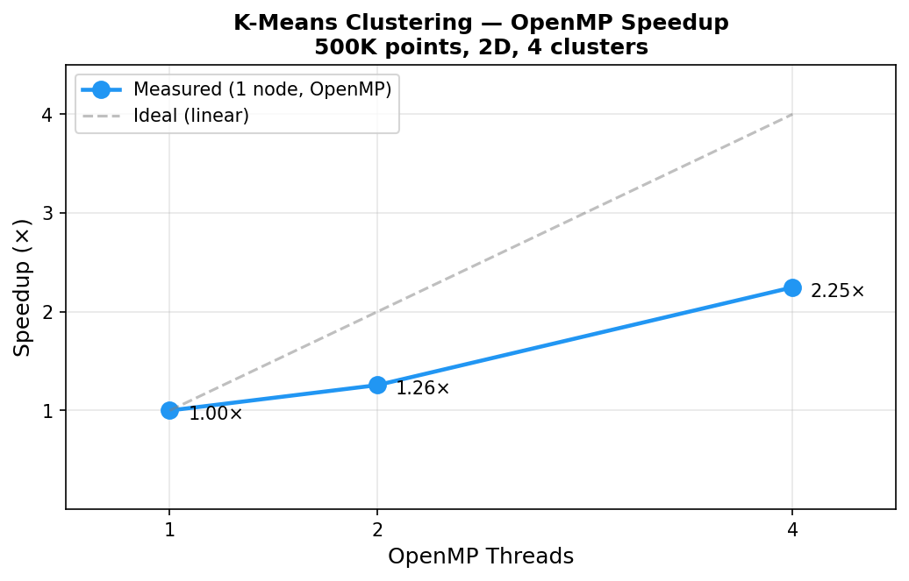

# Distributed K-Means Clustering (MPI + OpenMP)

A high-performance implementation of the K-means clustering algorithm using **MPI** for distributed computing across multiple nodes and **OpenMP** for shared-memory parallelism within each node.

> **Highlights:** Hybrid parallelism, balanced workload across processes, N-dimensional support, configurable K, and convergence detection — all in ~250 lines of C++.

## Architecture

```
┌─────────────────────────────────────────────────┐
│              Rank 0: Data Loading                │
│         (reads binary file, distributes)        │
└─────────────────┬───────────────────────────────┘
                  │ MPI_Scatterv
    ┌─────────────┼─────────────┐
    ▼             ▼             ▼
┌────────┐  ┌────────┐  ┌────────┐
│ Rank 0 │  │ Rank 1 │  │ Rank N │
│ OpenMP │  │ OpenMP │  │ OpenMP │
│ threads│  │ threads│  │ threads│
└───┬────┘  └───┬────┘  └───┬────┘
    │            │            │
    └────────────┼────────────┘
                 │ MPI_Allreduce (partial sums)
                 ▼
         Iterate until convergence
```

Points are distributed evenly and remain static. On every iteration:

1. Each process assigns its local points to the nearest centroid (OpenMP-parallel)
2. Partial sums and counts per cluster are computed locally (OpenMP-parallel)
3. Partial results are combined globally via `MPI_Allreduce`
4. Centroids are updated from global sums
5. Convergence is reached when <0.1% of points change cluster
6. Global statistics (min, max, mean, variance) are computed via MPI reductions after convergence

## Key Features

- **Hybrid parallelism**: MPI (inter-node) + OpenMP (intra-node)
- **Balanced workload**: points stay evenly distributed, no migration needed
- **Configurable K**: number of clusters is independent of the number of processes
- **N-dimensional**: works with arbitrary-dimensional data
- **Binary I/O**: efficient data format for large datasets

## Prerequisites

- C++ compiler with C++11 support
- MPI implementation (OpenMPI or MPICH)
- OpenMP support (included with GCC)

```bash
# Ubuntu/Debian
sudo apt install mpich libmpich-dev

# macOS
brew install open-mpi
```

## Build & Run

```bash
# Build
make

# Generate sample data (4 clusters, 500 points each)
./generate_data 4 500

# Run with 4 MPI processes, 4 clusters
mpirun -np 4 ./kmeans 4

# K independent of processes: 6 clusters on 2 processes
mpirun -np 2 ./kmeans 6

# Optional: control threads per process
export OMP_NUM_THREADS=4
mpirun -np 4 ./kmeans 4
```

## Example Output

```
Number of rows: 2000
Number of dimensions: 2
Rank 0 received 500 points
Rank 1 received 500 points
Rank 2 received 500 points
Rank 3 received 500 points

Centroids iter: 0
Group 0: [ 3.21 -7.84 ]
Group 1: [ -12.05 14.32 ]
Group 2: [ 8.67 9.11 ]
Group 3: [ -5.43 -11.20 ]

Change percentage: 62.5%. iter: 0
...
Convergence reached at iteration 8 with 0.09% global changes.

--- Global Statistics ---
Dim 0: Min=-14.2 Max=10.8 Mean=-1.4 Variance=72.3
Dim 1: Min=-13.5 Max=16.1 Mean=1.1 Variance=98.7

Total execution time: 0.041 s
```

## Design Decision: Static Distribution vs Point Migration

A common academic approach assigns one cluster per MPI process and migrates points between processes each iteration (`MPI_Alltoallv`). This implementation deliberately uses **static data distribution** instead:

- **Balanced workload**: Each process always holds ~N/P points regardless of cluster sizes. The migration model suffers chronic load imbalance when clusters have uneven sizes.
- **Predictable communication**: `MPI_Allreduce` on fixed-size partial sums replaces variable-size `MPI_Alltoallv` messages, eliminating the need for a two-step size-negotiation protocol.
- **Less memory churn**: Points never move, so no per-iteration reallocations or send buffers are needed.
- **K independent of P**: The number of clusters is not tied to the number of processes, allowing flexible deployment.

The tradeoff is that every process computes distances to all K centroids for its local points, but this is trivially parallelized with OpenMP and scales linearly.

## Performance



Measured on 1M points (2D, 4 clusters), varying MPI processes and OpenMP threads.

```bash
# Reproduce
chmod +x benchmark.sh
make && ./benchmark.sh
python3 plot_benchmark.py
```

## Data Format

The binary input file (`dataset.bin`) structure:

| Field       | Type     | Description           |
|-------------|----------|-----------------------|
| nPoints     | uint32_t | Number of data points |
| nDimensions | uint32_t | Dimensions per point  |
| data        | float[]  | Row-major point data  |

## Project Structure

```
├── main.cpp           # MPI + OpenMP K-means implementation
├── generate_data.cpp  # Dataset generator (Gaussian clusters)
├── Makefile           # Build configuration
├── benchmark.sh       # Performance measurement script
├── plot_benchmark.py  # Speedup visualization
└── README.md
```

## Technologies

- **C++11** — Core language
- **MPI** — Distributed memory parallelism (Scatterv, Allreduce, Reduce, Bcast)
- **OpenMP** — Shared memory parallelism (parallel for, reductions, critical sections)

## License

MIT
